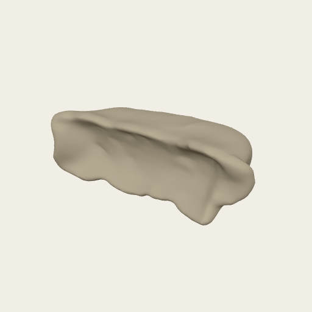
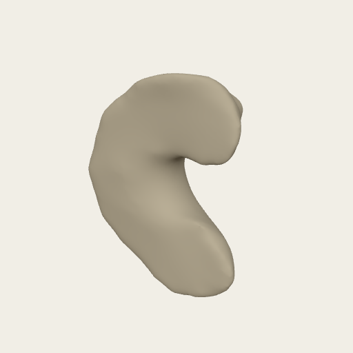

# Phytolith 3D models (demo)

Demonstration set for the Strömberg lab (UW Biology / Burke Museum paleobotany). Grass phytoliths (silica bodies about 20 micrometres long) imaged by confocal microscopy after fluorescent staining, segmented by hand in Fiji, meshed and decimated to 20 000 faces in MeshLab, and aligned for 3D geometric morphometrics (landmarks and surface semilandmarks placed in Checkpoint). 

- License: CC BY 4.0 (see `LICENSE.txt`)
- Curated by [@muratmaga](https://github.com/muratmaga)
- Created with [models.morphodepot.org](https://models.morphodepot.org), part of [MorphoDepot](https://morphodepot.org)
- **Download all models:** [v1 (zip)](https://github.com/muratmaga/phytolith-3d-models-demo/archive/refs/tags/v1.zip)

## Models (2)

### Aira caryophylla (1)

| | Model | Specimen | Triangles | Format | Source |
|---|---|---|---|---|---|
|  | [Aira caryophylla phytolith (pmr642)](models/aira_caryophylla_pmr642_3_29_2019_009_aligned.ply) | pmr642, scan 3/29/2019 #009 | 20,000 | PLY | confocal microscopy, segmented |

### Anomochloa marantoidea (1)

| | Model | Specimen | Triangles | Format | Source |
|---|---|---|---|---|---|
|  | [Anomochloa marantoidea phytolith (pmr401)](models/anomochloa_marantoidea_pmr401_04_28_2026_010_aligned.ply) | pmr401, scan 4/28/2026 #010 | 20,000 | PLY | confocal microscopy, segmented |
